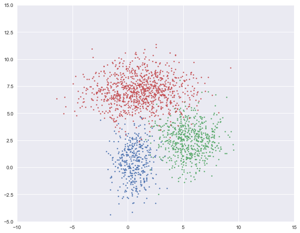
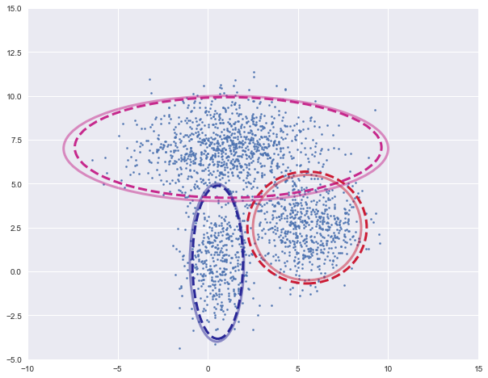
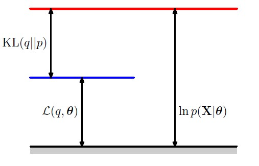
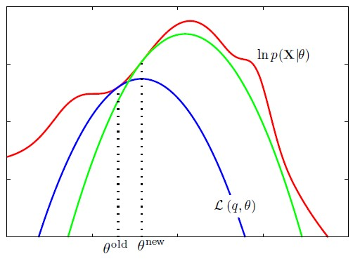
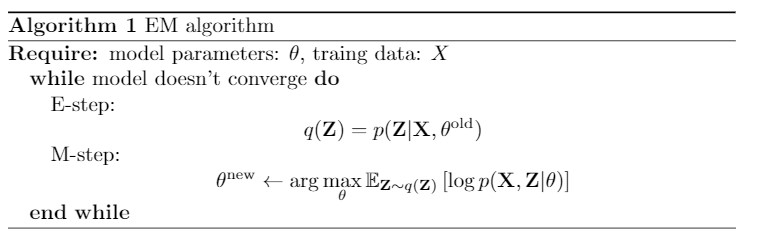

#  机器学习算法-GMM和EM算法

[TOC]

## 1. GMM模型

​		聚类问题是一个经典的无监督任务，其目标是将$N$个$D$维数据$\{\bf{x}_i\}_{i=1}^N$分成$K$个簇，使得每个簇中的样本尽可能相似。GMM算法对数据分布做了一些假设：

+ 第$k$个簇数据点服从正态分布，即$\mathbf{x}|\mathbf{z}\sim \mathcal{N}(\mu_k, \Sigma_k)$
+ 簇标签$\mathbf{z}\sim \mathrm{Dir}(\alpha)$

其中簇标签$\mathbf{z}$满足$\mathbf{z}\in \{0, 1\}^K, \quad \sum_{k=1}^K z_k = 1,\quad p(z_k=1)=\alpha_k$。根据条件概率和边缘分布可得：
$$
p(\mathbf{x}) = \sum_\mathbf{z} p(\mathbf{x}, \mathbf{z})=\sum_\mathbf{z} p(\mathbf{x}|\mathbf{z})p(\mathbf{z})
$$
代入相关的概率分布得到：
$$
p(\mathbf{x})=\sum_{k=1}^K \alpha_k \mathcal{N}(\mathbf{x}|\mu_k, \Sigma_k)
$$
需要求解的模型参数为$\{\alpha_k, \mu_k, \sigma_k^2\}_{k=1}^K$共计$K\times(1+D+D^2)$个参数。


## 2. GMM模型参数求解

​		为了估计GMM分布中的参数，采用MLE或者MAP即可实现。以MLE为例，目标函数为：
$$
f(\alpha, \mu, \Sigma)=\log \prod_{n=1}^N \sum_{k=1}^K \alpha_k \mathcal{N}(x_n|\mu_k, \Sigma_k)
$$

### 2.1 参数$\alpha$的求解

​		参数$\alpha$需要满足$\sum_k \alpha_k=1$的条件，拉格朗日函数为：
$$
\mathcal{L} = \sum_{n=1}^N\log \sum_{k=1}^K \alpha_k \mathcal{N}\mathbf{x}_n|\mu_k, \Sigma_k) + \lambda(\sum_{k=1}^K\alpha_k - 1)
\\
\nabla_{\alpha_k}\mathcal{L} = \sum_{n=1}^N \frac{1}{\sum_{j=1}^K \alpha_j \mathcal{N}(\mathbf{x}_n|\mu_j, \Sigma_j)} \mathcal{N}(\mathbf{x}_n|\mu_k, \Sigma_k)+\lambda = 0
$$
对梯度等式两边同乘上$\alpha_k$并对k求和得到$\lambda = -\frac{1}{N}$。定义模型对数据$\mathbf{x}_n$的响应$\gamma_{nk}$为：
$$
\gamma_{nk} = \frac{\alpha_k \mathcal{N}(\mathbf{x}_n|\mu_k, \Sigma_k)}{\sum_{j=1}^K \alpha_j \mathcal{N}(\mathbf{x}_n|\mu_j, \Sigma_j)}
$$
 得到参数$\alpha$的估计为：
$$
\alpha_k = \frac{1}{N}\sum_{n=1}^N \gamma_{nk} \triangleq \frac{N_k}{N}
$$

### 2.2 参数$\mu$和$\Sigma$的求解

​		参数$\mu$和$\Sigma$没有任何限制，对似然函数直接求导即可得到：
$$
\nabla_{\mu_k} f = \sum_{n=1}^N \frac{\alpha_k}{\sum_{j=1}^K \alpha_j \mathcal{N}(\mathbf{x}_n|\mu_j, \Sigma_j)} \frac{\partial \mathcal{N}(\mathbf{x}_n|\mu_k, \Sigma_k)}{\partial \mu_k}\\
\nabla_{\Sigma_k} f = \sum_{n=1}^N \frac{\alpha_k}{\sum_{j=1}^K \alpha_j \mathcal{N}(\mathbf{x}_n|\mu_j, \Sigma_j)} \frac{\partial \mathcal{N}(\mathbf{x}_n|\mu_k, \Sigma_k)}{\partial \Sigma_k}
$$


代入正态分布的表达式$\mathcal{N}(\mathbf{x}|\mu_k, \Sigma_k) = \frac{1}{(2\pi)^{\frac{D}{2}}|\Sigma|^{\frac{1}{2}}}\exp\{-\frac{1}{2}(\mathbf{x}-\mu_k)^T\Sigma_k^{-1}(\mathbf{x}-\mu_k)\}$得到：
$$
\begin{align}
\frac{\partial \mathcal{N}(\mathbf{x}|\mu_k, \Sigma_k^2)}{\partial \mu_k} &= \frac{1}{(2\pi)^{\frac{D}{2}}|\Sigma|^{\frac{1}{2}}}\exp\{-\frac{1}{2}(\mathbf{x}-\mu_k)^T\Sigma_K^{-1}(\mathbf{x}-\mu_k)\} \times (-\frac{1}{2}\times 2 \times \Sigma_k^{-1}(\mathbf{x}-\mu_k)) \\
&= -\mathcal{N}(\mathbf{x}|\mu_k, \Sigma_k)\Sigma_k^{-1}(\mathbf{x}-\mu_k)
\end{align}
$$

$$
\begin{align}
\frac{\partial \mathcal{N}(\mathbf{x}_n|\mu_k, \Sigma_k^2)}{\partial \Lambda_k} =& \frac{1}{\left(2\pi\right)^{\frac{D}{2}}}(\frac{1}{2}|\Lambda_k|^{-\frac{1}{2}})\exp\{-\frac{1}{2}(\mathbf{x}-\mu_k)^T\Lambda_k(\mathbf{x}-\mu_k)\}\frac{\partial |\Lambda_k|}{\partial\Lambda_k} \\
&+ \frac{|\Lambda|^{\frac{1}{2}}}{(2\pi)^{\frac{D}{2}}}\exp\{-\frac{1}{2}(\mathbf{x}-\mu_k)^T\Lambda_k(\mathbf{x}-\mu_k)\}\Big(-\frac{1}{2}\Big)\frac{\partial}{\partial \Lambda_k}\Big((\mathbf{x}-\mu_k)^T\Lambda_k(\mathbf{x}-\mu_k)\Big) \\
\end{align}
$$

根据矩阵行列式的拉普拉斯展开$|A| = \sum_{j=1}^M a_{ij}M_{ij}$和逆矩阵计算公式$A^{-1} = \frac{1}{|A|}A^*$得到：
$$
\frac{\partial |A|}{\partial a_{ij}} = M_{ij} \Longrightarrow \frac{\partial |A|}{\partial A} = (A^*)^T
$$
将上式和$\frac{\partial \mathbf{x}^T A \mathbf{x}}{\partial A} = \mathbf{x}\mathbf{x}^T$带入到梯度表达式得到：
$$
\begin{align}
\frac{\partial \mathcal{N}(\mathbf{x}_n|\mu_k, \Sigma_k^2)}{\partial \Lambda_k} =& \frac{1}{2}\frac{|\Lambda_k|^{\frac{1}{2}}}{\left(2\pi\right)^{\frac{D}{2}}}\exp\{-\frac{1}{2}(\mathbf{x}-\mu_k)^T\Lambda_k(\mathbf{x}-\mu_k)\}\Lambda_k^{-1} \\
&-\frac{1}{2} \frac{|\Lambda|^{\frac{1}{2}}}{(2\pi)^{\frac{D}{2}}}\exp\{-\frac{1}{2}(\mathbf{x}-\mu_k)^T\Lambda_k(\mathbf{x}-\mu_k)\}(\mathbf{x}-\mu_k)(\mathbf{x}-\mu_k)^T \\
=& \frac{1}{2}\mathcal{N}(\mathbf{x}|\mu_k, \Sigma_k)\{\Sigma_k - (\mathbf{x}-\mu_k)(\mathbf{x}-\mu_k)^T\}
\end{align}
$$
将上述求导结果代入到似然函数的梯度中得到：
$$
\mu_k = \frac{1}{N_k}\sum_{n=1}^N \gamma_{nk}\mathbf{x}_n\\
\Sigma_k = \frac{1}{N_k}\sum_{n=1}^N \gamma_{nk}(\mathbf{x}-\mu_k)(\mathbf{x}-\mu_k)^T
$$

## 3. GMM算法的实现

​		根据模型参数求解的结果可知，在更新参数时需要知道$\gamma_{nk}$，而计算$\gamma_{nk}$又需要知道模型参数，陷入到了一个循环中。GMM采用了EM算法更新这两部分参数：

+ E-step：固定模型，计算$\gamma_{nk}$
+ M-step：运用极大似然估计更新模型参数

重复迭代E-step和M-step直到模型收敛。

### 3.1 gmm类的定义和实现

​		gmm类需要记录数据的维度和簇的数目，为了后续的方便，将样本数量也作为初始化参数记录；然后生成了三个模型参数，为了简化将协方差矩阵限定为对角矩阵。方法包含了两个主要方法和三个辅助函数：

+ train：训练函数，根据数据集计算出模型参数
  + step：单步的训练，包含了E-step和M-step
  + _prob：多元高斯密度计算
  + _log_likelihood：计算当前模型下的对数似然
+ cluster：预测函数，将数据集进行聚类

```python
class gmm():
    def __init__(self, dims, K, N):
        self.dims = dims
        self.K = K
        self.N = N
        self.mu = np.random.randn(K, dims)
        self.sigma = np.ones((K, dims))
        self.alpha = np.ones(K)/self.K
    
    def train(self, X, maxIter, verbos):
        for i in range(maxIter):
            self.step(X)
            if i % verbos == 0:
                logH = self._log_likelihod(X)
                print("In loop: %d, log likelihood : %f" %(i, logH))
        
    def step(self, X):
        
        # E-step
        p = self._prob(X) # N x K matrix
        alpha_p = self.alpha * p
        Z = np.sum(alpha_p, axis = 1, keepdims=True)
        gamma = alpha_p / Z
        N_k = np.sum(gamma, axis = 0)

        # M-step
        self.alpha = N_k / self.N
        tmp_mu = np.zeros_like(self.mu)
        tmp_sigma = np.zeros_like(self.sigma)
        for k in range(self.K):
            tmp_mu[k] = np.average(X, axis = 0, weights = gamma[:,k])
            tmp_sigma[k] = np.average((X - self.mu[k])**2, axis = 0, weights = gamma[:, k])
        self.mu = tmp_mu
        self.sigma = tmp_sigma
    
    def _log_likelihod(self, X):
        n_points, n_clusters = len(X), self.K
        pdfs = (self.alpha*self._prob(X)).sum(axis = 1)
        return np.mean(np.log(pdfs))
                       
    def _prob(self, X):
        n_points, n_clusters = len(X), self.K
        pdfs = np.zeros(((n_points, n_clusters)))
        for i in range(n_clusters):
            pdfs[:, i] = multivariate_normal.pdf(X, self.mu[i], np.diag(self.sigma[i]))
        return pdfs

    def cluster(self, X):
        p = self._prob(X)
        labels = np.argmax(p, axis = -1)
        return labels
```

### 3.2 测试

导入相关包

```python
import numpy as np
import matplotlib.pyplot as plt
from matplotlib.patches import Ellipse
from scipy.stats import multivariate_normal
from GMM import *
```

生成样本数据并可视化

```python
#%% 生成数据
num1, mu1, var1 = 400, [0.5, 0.5], [1, 3]
X1 = np.random.multivariate_normal(mu1, np.diag(var1), num1)

num2, mu2, var2 = 600, [5.5, 2.5], [2, 2]
X2 = np.random.multivariate_normal(mu2, np.diag(var2), num2)

num3, mu3, var3 = 1000, [1, 7], [6, 2]
X3 = np.random.multivariate_normal(mu3, np.diag(var3), num3)

X = np.vstack((X1, X2, X3))

#%% 可视化数据点
plt.figure(figsize=(10, 8))
plt.axis([-10, 15, -5, 15])
plt.scatter(X1[:, 0], X1[:, 1], s=5)
plt.scatter(X2[:, 0], X2[:, 1], s=5)
plt.scatter(X3[:, 0], X3[:, 1], s=5)
plt.show()
```

实例化一个模型并训练

```python
model = gmm(X.shape[1], 3, X.shape[0])
max_Iter = 60
verbos = 10
model.train(X, max_Iter, verbos)
```

可视化聚类结果，将各个高斯密度函数的等高线画出来，虚线为训练的模型，实线为实际的模型

```python
plot_clusters(X, model.mu, model.sigma, [mu1, mu2, mu3], [var1, var2, var3])
```

为了实现可视化过程，定义了绘制簇的函数

```python
def plot_clusters(X, Mu, Var, Mu_true=None, Var_true=None):
    assert X.shape[1] == 2, "this function can't plot 3D figure"

    n_clusters = len(Mu)
    # colors = ['r', 'g', 'b']
    colors = [0]*n_clusters
    for i in range(n_clusters):
        colors[i] = randomcolor()

    plt.figure(figsize=(10, 8))
    plt.axis([-10, 15, -5, 15])
    plt.scatter(X[:, 0], X[:, 1], s=5) # markersize = 5
    ax = plt.gca() # get current axis
    
    for i in range(n_clusters):
        plot_args = {'fc': 'None', 'lw': 3, 'edgecolor': colors[i], 'ls': '--'}
        ellipse = Ellipse(Mu[i], 3 * Var[i][0], 3 * Var[i][1], **plot_args)
        ax.add_patch(ellipse)
    if (Mu_true is not None) & (Var_true is not None):
        for i in range(n_clusters):
            plot_args = {'fc': 'None', 'lw': 3, 'edgecolor': colors[i], 'alpha': 0.5}
            ellipse = Ellipse(Mu_true[i], 3 * Var_true[i][0], 3 * Var_true[i][1], **plot_args)
            ax.add_patch(ellipse)
    plt.show()

def randomcolor():
    colorArr = ['1','2','3','4','5','6','7','8','9','A','B','C','D','E','F']
    color = ""
    for i in range(6):
        color += colorArr[np.random.randint(0,14)]
    return "#"+color
```

结果

<div>
    
    
</div>


## 4. EM算法

​		GMM仅仅是EM算法运用的一个特例。在EM算法中，假设数据是由两个部分组成：可观测部分$\mathbf{x}$和隐变量$\mathbf{z}$，两者组合在一起$\{\mathbf{x}, \mathbf{z}\}$称为完全数据。在实际应用中，完全数据是无法获取的，根据完全数据进行MLE或者MAP是不现实的，而用完全数据进行估计比用可观测数据对模型进行估计简单。EM算法提供了一种转换办法。

​		定义记号：

+ 数据集：$\mathbf{X} = \{\mathbf{x}_n\}_{n=1}^N$
+ 隐变量：$\mathbf{Z} = \{z_n\}_{n=1}^N$

+ 数据分布：$p(\mathbf{X}) = \prod_{n=1}^N p(\mathbf{x}), \quad p(\mathbf{X}, \mathbf{Z})=\prod_{n=1}^Np(\mathbf{x_n}, \mathbf{z_n})$，可以验证这种定义方式满足条件概率和边缘概率公式：
  $$
  p(\mathbf{X}) = \sum_{\mathbf{Z}}p(\mathbf{X}, \mathbf{Z}), \quad p(\mathbf{X}|\mathbf{Z}) = \frac{p(\mathbf{X}, \mathbf{Z})}{p(\mathbf{Z})}
  $$
  ​	在完全数据上的似然函数为：
  $$
  \mathcal{L} = \log p(\mathbf{X}|\theta)
  $$

假设隐变量的条件分布为$q(\mathbf{Z})$，似然函数可以被写作：
$$
\begin{align}
\mathcal{L} &= \sum_{\mathbf{Z}} q(\mathbf{Z})\log \Bigg(\frac{p(\mathbf{X}, \mathbf{Z})}{q(\mathbf{Z})}\times \frac{q(\mathbf{Z})}{p(\mathbf{Z}|\mathbf{X})}\Bigg) \\
&= \sum_{\mathbf{Z}}q(\mathbf{Z})\log \frac{p(\mathbf{X}, \mathbf{Z})}{q(\mathbf{Z})} - \sum_{\mathbf{Z}}q(\mathbf{Z})\log\frac{p(\mathbf{Z}|\mathbf{X})}{q(\mathbf{Z})}\\
&\triangleq \mathcal{L}_{\mathrm{ELBO}}(q,\theta)+\mathrm{KL}(q||p)\\
\end{align}
$$
根据以上公式可知，可观测数据的似然函数与证据下界之间差了一个KL散度。

<div>
    
    
</div>

从该角度可以理解EM算法的流程：

+ E-step：求解似然函数的下界，该过程是一个关于函数q的变分问题
+ M-step：最大化似然函数的下界

该过程需要重复进行，这是因为最大化下界之后，模型的参数会变为$\theta^{new}$，此时似然函数的下界已经发生了改变，需要重新计算。

*

​		EM算法同样适用于MAP框架。在MAP中，目标函数变为：
$$
\begin{align}
\mathcal{L} &= \log p(\theta|\mathbf{X}) \\
&= \log \frac{p(\mathbf{X}|\theta)p(\theta)}{p(\mathbf{X})}\\
&= \log p(\mathbf{X}|\theta) +\log p(\theta)-\log p(\mathbf{X})
\end{align}
$$
相比于MLE，MAP多出了一项关于模型参数的似然（数据先验分布似然不影响参数的求解，可以忽略），这一项可以被看作是对模型参数的正则化。