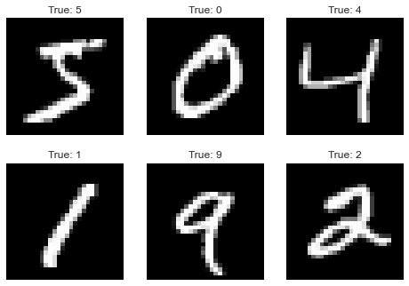
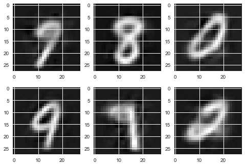

# 机器学习算法-VAE

[TOC]

## 1. VAE模型推导

### 1.1 算法引入

​		在EM算法中，隐变量的最优分布$q^{\star}(\mathbf{z})$是在观测数据给定时的条件分布$p(\mathbf{z}|\mathbf{x})$，此时对应的证据下界与似然函数相等。但是在实际中，后验概率可能很难计算甚至不能计算，这时EM算法中的E-step便无法进行。VAE的思路是用一个新的分布$q(\mathbf{z}|\mathbf{x})$进行估计：
$$
q^{\star}(\mathbf{z}|\mathbf{x}) = \arg\min_q \mathrm{KL}(q(\mathbf{z}|\mathbf{x})|| p(\mathbf{z}|\mathbf{x}))
$$

### 1.2 模型推导

​		将KL散度的计算公式进行变形得到：
$$
\begin{align}
\mathrm{KL}(q(\mathbf{z}|\mathbf{x})||p(\mathbf{z}|\mathbf{x})) &= -\int_\mathbf{z} q(\mathbf{z}|\mathbf{x})\log\frac{p(\mathbf{z}|\mathbf{x})}{q(\mathbf{z}|\mathbf{x})}d\mathbf{z}\\
&= -\int_{\mathbf{z}}q(\mathbf{z}|\mathbf{x})\left[\frac{p(\mathbf{x},\mathbf{z})}{q(\mathbf{z}|\mathbf{x})}\right]d\mathbf{z} + \log p(\mathbf{x})\\
\Longrightarrow &\log p(\mathbf{x}) = \int_{\mathbf{z}}q(\mathbf{z}|\mathbf{x})\left[\frac{p(\mathbf{x},\mathbf{z})}{q(\mathbf{z}|\mathbf{x})}\right]d\mathbf{z} + \mathrm{KL}(q(\mathbf{z}|\mathbf{x})||p(\mathbf{z}|\mathbf{x})) \geq \mathcal{L}_{\mathrm{ELBO}}
\end{align}
$$
​		通过对KL散度的改写，我们找到了似然函数的一个下界，对这个下界优化可以近似得到似然函数的最优值。为了优化变分下界$\mathcal{L}_{\mathrm{ELBO}}$，将其形式进行变换：
$$
\begin{aligned}
\mathcal{L}_{\mathrm{ELBO}}(\mathbf{x}) &=\mathbb{E}_{\mathbf{z} \sim q(\mathbf{z} \mid \mathbf{x})} \left[\log \frac{p(\mathbf{x}, \mathbf{z})}{q(\mathbf{z}\mid \mathbf{x})}\right] \\
&=\mathbb{E}_{\mathbf{z} \sim q(\mathbf{z} \mid \mathbf{x})} \left[\log \frac{p(\mathbf{x} \mid \mathbf{z}) p(\mathbf{z})}{q(\mathbf{z} \mid \mathbf{x})}\right] \\
&=\int q(\mathbf{z} \mid \mathbf{x})(\log p(\mathbf{z})-\log q(\mathbf{z} \mid \mathbf{x})+\log p(\mathbf{x} \mid \mathbf{z})) d \mathbf{z} \\
&\left.=-\int q(\mathbf{z} \mid \mathbf{x})\left(\log \frac{q(\mathbf{z} \mid \mathbf{x})}{p(\mathbf{z})}\right) d \mathbf{z}+\int q(\mathbf{z} \mid \mathbf{x}) \log p(\mathbf{x} \mid \mathbf{z})\right) d \mathbf{z} \\
&=-\mathrm{KL}(q(\mathbf{z} \mid \mathbf{x}) \| p(\mathbf{z}))+\mathbb{E}_{\mathbf{z} \sim q(\mathbf{z} \mid \mathbf{x})}\left[\log p(\mathbf{x} \mid \mathbf{z})\right]
\end{aligned}
$$
​		变分下界中出现了三个概率分布，为了方便求解，并对分布的类型和参数做了假设：

+ $q(\mathbf{z}|\mathbf{x})$：编码器，根据样本$\mathbf{x}$生成对应的隐变量$\mathbf{z}$
  $$
  q(\mathbf{z}|\mathbf{x})=\mathcal{N}(\mu_1, \sigma_1^2)\\
  [\mu_1, \log\sigma_1^2] = f_{\theta}(\mathbf{x})
  $$

+ $p(\mathbf{x}|\mathbf{z})$：解码器，根据隐变量$\mathbf{z}$生成样本$\mathbf{x}$
  $$
  p(\mathbf{x}|\mathbf{z})=\mathcal{N}(\mu_2, \mathbf{I})\\
  \mu_2 = g_{\phi}(\mathbf{z})
  $$

+ $p(\mathbf{z})$：隐变量的先验分布
  $$
  p(\mathbf{z})=\mathcal{N}(\mathbf{0}, \mathbf{I})
  $$

其中$f_{\theta}(\cdot)$和$g_{\phi}(\cdot)$分别是参数为$\theta$和$\phi$的神经网络。

### 1.3 损失函数

​		在变分下界中存在两项：重构误差和KL散度项。重构误差实现了让解码出来的样本和真实样本尽可能接近，KL散度项对隐变量分布进行了限制，起到了正则化的作用。原始的重构误差可以通过蒙特卡洛采样计算得到：
$$
\mathbb{E}_{\mathbf{z}\sim q(\mathbf{z}|\mathbf{x})}\simeq \frac{1}{L}\sum_{l=1}^L \log p(\mathbf{x}|\mathbf{z}_l), \quad \mathbf{z}_l\sim  q(\mathbf{z}|\mathbf{x})
$$
事实上，将$p(\mathbf{x}|\mathbf{z}_l)$的表达式代入到公式中可以发现，重构误差本质上是原始样本$\mathbf{x}$和重构样本$\mathbf{x}_l$之间的欧氏距离。更一般地，可以将该项换为其他的损失函数。

​		KL散度项直接代入[高斯分布的KL散度计算公式](https://hsinjhao.github.io/2019/05/22/KL-DivergenceIntroduction/)可以得到：
$$
\mathrm{KL}(q(\mathbf{z} \mid \mathbf{x}) \| p(\mathbf{z}))  =  -\frac{1}{2} \sum_{j=1}^{J}\left(1+\log \sigma_{1j}^{2}-\mu_{1j}^{2}-\sigma_{1j}^{2}\right)
$$

### 1.4 重参数技巧

​		在解码过程需要用到样本的编码$\mathbf{z}$，编码$\mathbf{z}$是从分布$\mathcal{N}(\mu_1, \sigma_1^2)$中采样得到，而采样过程是一个“不可微分”的过程，对后续的反向传播带来了困难。重参数技巧运用了一个基本的定理：
$$
if \quad \mathbf{z}\sim\mathcal{N}(\mathbf{0}, \mathbf{I}), \quad then \quad \Sigma^{\frac{1}{2}}\mathbf{z}+\mu \sim \mathcal{N}(\mu, \Sigma)
$$
重参数的过程为：先从标准正态分布中生成一个样本$\mathbf{z}_0$，然后乘上标准差再加上均值。

## 2. 实现

### 2.1 模型定义

本文采用了Pytorch实现了VAE模型，并在MNIST数据集上进行了实验。神经网络选用了全连接网络，事实上也可以用其他网络，如CNN、RNN等

```python
class VAE(nn.Module):
    # 使用全链接网络
    def __init__(self, encoder_structure, decoder_structure, hidden_num):
        super(VAE, self).__init__()
        self.encoder = nn.Sequential()
        for i in range(1, len(encoder_structure)):
            self.encoder.add_module("linear"+str(i), nn.Linear(encoder_structure[i-1], encoder_structure[i]))
            self.encoder.add_module("relu"+str(i), nn.ReLU())

        self.z_layer = nn.Linear(encoder_structure[-1], hidden_num)
        self.log_var_layer = nn.Linear(encoder_structure[-1], hidden_num)

        self.decoder = nn.Sequential()
        for i in range(1, len(decoder_structure)):
            self.decoder.add_module("linear"+str(i), nn.Linear(decoder_structure[i-1], decoder_structure[i]))
            if(i < len(decoder_structure)-1): self.decoder.add_module("relu"+str(i), nn.ReLU())
    
    def forward(self, x):
        self.z_mean, self.z_log_var = self.encode(x)
        z = self._reparameters(self.z_mean, self.z_log_var)
        self.x_mean = self.decode(z)
        return self.z_mean, self.z_log_var, z, self.x_mean

    def encode(self, x):
        code = self.encoder(x)
        z_mean = self.z_layer(code)
        z_log_var = self.log_var_layer(code)
        return z_mean, z_log_var

    def decode(self, z):
        x_mean = self.decoder(z)
        return x_mean

    def loss(self, x, recon_func):
        KL_loss = -0.5 * torch.sum(1 + self.z_log_var - self.z_mean.pow(2) - self.z_log_var.exp())
        recon_loss = recon_func(self.x_mean, x)
        return KL_loss + recon_loss

    def _reparameters(self, z_mean, z_log_var):
        z0 = torch.randn_like(z_mean)
        return z_mean + z0 * torch.exp(0.5*z_log_var)
    
    def train(self, net, dataIter, recon_loss, optimizer, epoches):
        device = torch.device('cuda' if torch.cuda.is_available() else 'cpu')
        print("training on %s" %(device))
        net = net.to(device)
        train_loss = [0.]*epoches
        for epoch in range(epoches):
            cnt = 0
            for batch_idx, (data, label) in enumerate(dataIter):
                # 前向
                data = data.view(data.size(0), -1).to(device)
                z_mean, z_log_var, z, x_mean = net(data)
                loss = net.loss(data, recon_loss)
                # 反向
                optimizer.zero_grad()
                loss.backward()
                optimizer.step()
                train_loss[epoch] += loss.cpu().item()
                if((batch_idx+1) % 100 == 0):
                    print("epoch : {0} | #batch : {1} | batch average loss: {2}"
                          .format(epoch, batch_idx, loss.cpu().item()/len(data)))
            # train_loss[epoch] /= len(dataIter.dataset)
            print("Epoch : {0} | epoch average loss : {1}"
                  .format(epoch, train_loss[epoch] / len(dataIter.dataset)))
```

### 2.2 实验

导入相关包

```python
#%% 导入包
from AutoEncoder import *
import torch
from torch.utils.data import DataLoader
from torchvision import transforms
from torchvision.datasets import MNIST
from torchvision.utils import save_image
import matplotlib.pyplot as plt
```

下载数据集，并查看前六张图片

```python
#%%
img_transform = transforms.Compose([
    transforms.ToTensor()])
path = "../../dataset"
batch_size = 128
dataset = MNIST(path, transform=img_transform, train = True, download=False)
dataIter = DataLoader(dataset, batch_size=batch_size, shuffle=True)
imgs = dataset.data[:6].numpy()
labels = dataset.targets[:6].numpy()

_, axes = plt.subplots(2, 3)
for i in range(2):
    for j in range(3):
        axes[i][j].imshow(imgs[i*3 + j], cmap='gray')
        axes[i][j].set_title("True: " + str(labels[i*3+j]))
        axes[i][j].get_xaxis().set_visible(False)
        axes[i][j].get_yaxis().set_visible(False)
plt.show()
```



定义模型并训练

```python
#%%
encoder_structure = [784, 512, 64]
decoder_structure = [20, 64, 512, 784]
model = VAE(encoder_structure, decoder_structure, 20)
opt = torch.optim.Adam(model.parameters(), lr=1e-3)
print(model)
model.train(model, dataIter, nn.MSELoss(size_average=False), opt, 50)
```

随机采样几个编码，并生成样本

```python
shape = (6, 20)
z_mean = torch.rand(shape, device='cuda')

rand_z = torch.randn(shape,device='cuda') + z_mean
gen_x = model.decode(rand_z).cpu()
rand_img = to_image(gen_x).detach().numpy()
# rand_img = (rand_img * 255 / (rand_img.max() - rand_img.min())).astype(np.uint8)
_ ,axes = plt.subplots(2, 3)
for i in range(2):
    for j in range(3):
        axes[i][j].imshow(rand_img[i*3+j], cmap='gray')
plt.show()
```



高糊。。。。。