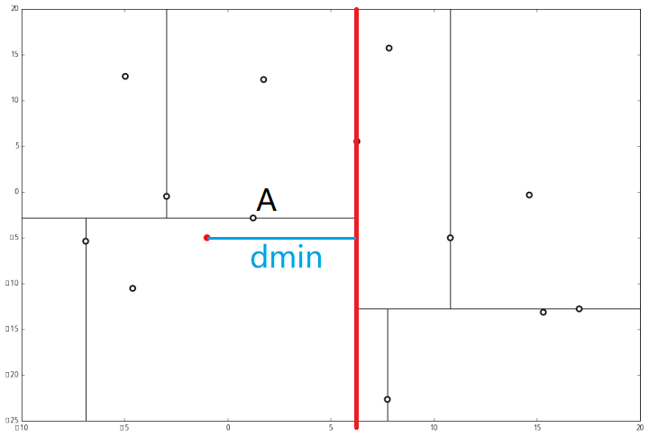
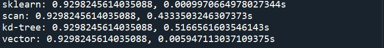

# 机器学习算法——kNN

[TOC]

## 1. 算法原理

基本思想是物以类聚，相同类别的样本之间在特征空间中应当聚集在一起，因此对于新的数据点，根据其附近的K个邻居的类型可以对其进行预测。如下图所示，假设红、绿、蓝三种颜色的点分布在二维空间中，这对应着分类任务中的训练样点包含了3个类别，特征数量为2。如果现在我们希望推测图中空心圆的那个点是属于那个类别，那么kNN算法将会计算该待推测点与所有训练样点之间的距离，并且挑选出距离最小的k个样点（此处设定k=4），则图中与连接的4个点将被视为推测空心点（待推测点）类别的参考依据。显然，由于这4个点均为红色类别，则该待推测点即被推测为红色类别。


## 2. 算法实现[^1][^2]

kNN算法的瓶颈是如何寻找未知点x的K个最近邻。

+ 暴力计算：计算出点x和数据集中所有点的距离，然后选出最近的K个，该方法对设备的存储和计算能力要求高，在数据集小的时候效果较好
+ 索引：通过对数据集建立索引实现分支限界，减小搜索的范围。常用的索引结构有kd-tree/R-tree/ball-tree等，kd-tree在维数小于20时的效果较好
+ 哈希：局部敏感哈希，通过选用合适的哈希函数，将相近的点映射到相近的子空间

本项目实现了暴力计算和kd-tree索引的kNN算法

### 2.1 kd-tree构造

kd树是一个二叉树结构，相当于不断的用垂线将k维空间进行切分，构成一系列的k维超矩形区域。kd-tree算法如下：

K维空间数据集$T = \{x_i\}_{i=1}^N$，其中$x_i = [x_i^{(1)}, x_i^{(2)}, ..., x_i^{(k)}]$ 

1. 构造根节点 ：选择合适的坐标轴$l$，将T中所有实例以$x^{(l)}$坐标为中位数，垂直轴切$x^{(l)}$成两个矩形，由根节点生成深度为1的左、右两个子节点：左子节点对应的坐标都小于切分点，右子节点坐标都大于切分点坐标。
2. 重复：对深度为j的节点，选择合适的坐标轴，以该节点再次将矩形区域切分为两个子区域。
3. 直到两个子区域没有实例存在时停止，从而形成kd-tree的区域划分。

**例子**：首先随机在数据集中随机生成 13 个点作为我们的数据集


首先先沿 x 坐标进行切分，我们选出 x 坐标的中位点，获取最根部节点的坐标


并且按照该点的x坐标将空间进行切分，所有 x 坐标小于 6.27 的数据用于构建左分支，x坐标大于 6.27 的点用于构建右分支。


在下一步中$r = 0 + 1 =1\  mod \ 2$，对应 y 轴，左右两边再按照 y 轴的排序进行切分，中位点记载于左右枝的节点。得到下面的树，左边的 x 是指这该层的节点都是沿 x 轴进行分割的。


空间的切分如下：


下一步中，对应 x 轴，所以下面再按照 x 坐标进行排序和切分，有


最后每一部分都只剩一个点，将他们记在最底部的节点中。因为不再有未被记录的点，所以不再进行切分。


就此完成了 kd 树的构造。python代码如下：

```python
class Node():
    def __init__(self, data = -1, label = None, left = None, right = None, split = 0):
        self.left = left
        self.right = right
        self.split = split
        self.data = data
        self.label = label

class kdTree():
    def __init__(self, X, y):
        self.dim = X.shape[1]
        if(y.ndim == 1): y = np.expand_dims(y, 0)
        data = np.hstack((X, y.reshape(-1, 1)))
        self.root = self._create(data, 0)
        
    def _create(self, dataset, p):
        # 边界条件
        if len(dataset) == 0: return None
        
        # 寻找中位数，使用快速排序中的partition，复杂度为O(logn)
        # numpy.argpartition(a, kth, axis=-1, kind='introselect', order=None)
        mid = len(dataset) // 2
        idxs = np.argpartition(dataset[:, p], mid)
        # 建立当前节点
        tmp = Node(data = dataset[idxs[mid]])
        # 创建子节点
        lchild = self._create(dataset[idxs[:mid],:], (p+1) % self.dim)
        rchild = self._create(dataset[idxs[mid+1:],:], (p+1) % self.dim)
        
        tmp.left, tmp.right = lchild, rchild
        return tmp
    def search(self, target, K):
        pass
```

### 2.2 kd-tree查询

kd-tree加快查询的原理是根据数据集的空间位置信息，剪除一些搜索分支。以下图为例，在搜索红点的最近邻时，在红线右侧的点肯定比点A离红点更远，因为红线右侧区域到红点最近的距离是红点到红线的距离，而该距离已经比A和红点之间距离更大了。



k近邻查询算法如下：

1. 从根结点出发，递归向下访问kd-tree，如果目标点x当前维小于切分点坐标，移动到左子节点，否则右子节点，直到子节点为叶子结点为止。
2. 以此叶子结点为最近邻的点，插入到nearest[ ]中
3. 递归向上回退，在这个节点进行以下操作：

-  如果该节点比nearest[ ]里的点更近，则替换nearest[ ]中距离最大的点。
- 目标点到此节点的分割线垂直的距离为d，判断nearest[ ]中距离最大的点与 d 相比较,如果比d大，说明d的另一侧区域中有可能有比nearest[ ]中距离要小，因此需要查看d的左右两个子节点的距离。 如果nearest[ ]中距离最大的点比 d小，那说明另一侧区域的点距离目标点的距离都比d大，因此不用查找了，继续向上回退。

4. 当回退到根结点时，搜索结束，最后的nearest[ ]里的k个点，就是x的最近邻点。

代码实现既可以使用递归也可以使用迭代，在本项目中使用了迭代

```python
	def search(self, target, K):
        # 记录搜索的路径
        path = []
        # 记录搜索过的节点、距离、标签等信息
        nodes = []
        dist = []
        labels = []
        if(K == 0 or self.root == None):
            return nodes, labels, dist 
        
        # step1: 搜索叶子结点
        tmp_node = self.root
        while tmp_node:
            path.append(tmp_node)
            idx = tmp_node.split
            
            if(target[idx] <= tmp_node.data[idx]): 
                tmp_node = tmp_node.left
            else:
                tmp_node = tmp_node.right
        
        # step2: 回溯
        max_index = 0
        first_node = path[-1]
        d = self._compute_dist(first_node.data[:-1], target)
        nodes.append(first_node)
        dist.append(d)
        labels.append(first_node.data[-1])
    
        while len(path)!= 0:
            back_node = path.pop()
            tmp_d = self._compute_dist(back_node.data[:-1], target)
            # 已经到叶子节点
            if(back_node.left == None and back_node.right == None):
                if(back_node != first_node):
                    if(len(nodes) < K or tmp_d < dist[max_index]):
                        if(len(nodes) < K):
                            dist.append(tmp_d)
                            nodes.append(back_node)
                            labels.append(back_node.data[-1])
                            if(len(nodes) == K):
                                max_index = np.argmax(dist)
                        else:
                            dist[max_index] = tmp_d
                            nodes[max_index] = back_node
                            labels[max_index] = back_node.data[-1]
                            max_index = np.argmax(dist)
            # 非叶子节点
            else:
                # 判断是否加入父节点
                if(len(nodes) < K or tmp_d < dist[max_index]):
                    if(len(nodes) < K):
                        dist.append(tmp_d)
                        nodes.append(back_node)
                        labels.append(back_node.data[-1])
                        if(len(nodes) == K):
                            max_index = np.argmax(dist)
                    else:
                        dist[max_index] = tmp_d
                        nodes[max_index] = back_node
                        labels[max_index] = back_node.data[-1]
                        max_index = np.argmax(dist)
                
                #step3: 判断是否需要进入另一个分支
                tmp_idx = back_node.split
                if(len(nodes) < K or
                    abs(back_node.data[tmp_idx]-target[tmp_idx]) <= dist[max_index]):
                    if(target[idx] <= back_node.data[tmp_idx]):
                        child_node = back_node.right
                    else:
                        child_node = back_node.left
                    
                    while(child_node != None):
                        path.append(child_node)
                        if(target[child_node.split] <= child_node.data[child_node.split]):
                            child_node = child_node.left
                        else:
                            child_node = child_node.right
        return nodes, labels, dist
    def _compute_dist(self, x, y):
        return np.sum((x - y) ** 2)
```

### 2.3 kNN算法实现

kNN算法没有训练过程，如果使用索引，在训练过程建立对应的索引即可。在预测阶段分为两个部分：计算K近邻、根据K近邻的标签进行投票

```python
class kNN():
    def __init__(self, K, method = "scan"):
        self.K = K
        self.method = method
        
    def train(self, X, y):
        self.X = X
        self.y = y
        if self.method == "kd-tree":
            self.tree = kdTree(X, y)
    
    def test(self, x):
        if x.ndim == 1: 
            x = np.expand_dims(x, axis = 0)
        labels = []
        y_preds = [0]*x.shape[0]
        # 顺序扫描
        if self.method == "scan":
            for i in range(x.shape[0]):
                dist = []
                label = []
                max_index = 0
                for j in range(self.X.shape[0]):
                    tmp_d = np.sum((x[i]-self.X[j]) ** 2)
                    if len(dist) < self.K:
                        dist.append(tmp_d)
                        label.append(self.y[j])
                        if(len(dist) == self.K):
                            max_index = np.argmax(dist)
                    elif(tmp_d < dist[max_index]):
                        dist[max_index] = tmp_d
                        label[max_index] = self.y[j]
                        max_index = np.argmax(dist)
                labels.append(label)
        # 使用kd-tree
        elif self.method == "kd-tree":
            for i in range(x.shape[0]):
                _, label, _ = self.tree.search(x[i], self.K)
                labels.append(label)
        # 直接向量化计算
        else:
            dist = np.sum(np.power(x,2), axis = -1, keepdims = True) - 2 * np.dot(x, self.X.T) + np.sum(self.X ** 2, axis = -1).T
            if dist.ndim == 1: 
                dist = np.expand_dims(dist, axis = 0)
            top_K_index = np.argsort(dist, axis = -1)[:, :self.K]
            labels = self.y[top_K_index]
        
        labels = np.array(labels)
        for i in range(x.shape[0]):
            y_preds[i] = self._vote(labels[i,:])
        
        return np.array(y_preds)
	# 对标签进行投票
    def _vote(self, ys):
        ys_unique = np.unique(ys)
        vote_dict = {}
        for y in ys:
            if y not in vote_dict.keys():
                vote_dict[y] = 1
            else:
                vote_dict[y] += 1
        sorted_vote_dict = sorted(vote_dict.items(), key=operator.itemgetter(1), reverse=True)
        return sorted_vote_dict[0][0]
```

## 3. 算法测试[^3]

数据集：breast_cancer数据集（预测是否患乳腺癌）

模型：sklearn内置kNN、线性搜索+kNN、kd-tree+kNN、暴力计算+kNN

```python
from knn import *
from time import time
from sklearn.datasets import load_breast_cancer
from sklearn.model_selection import train_test_split 
from sklearn.neighbors import KNeighborsClassifier
# 导入数据集
data = load_breast_cancer()
x = data.data
y = data.target
# 划分数据集
Xtrain,Xtest,Ytrain,Ytest = train_test_split(x,y,test_size =0.2) #2/8分
# 创建分类器，最近邻K=5
clf = KNeighborsClassifier(n_neighbors=5, algorithm='kd_tree') #实例化  #里面的参数：超参数
clf1 = kNN(5, "scan")
clf2 = kNN(5, "kd-tree")
clf3 = kNN(5, "vector")
# 训练
clf.fit(Xtrain, Ytrain)
clf1.train(Xtrain, Ytrain)
clf2.train(Xtrain, Ytrain)
clf3.train(Xtrain, Ytrain)
# 预测并测试时间
t0 = time()
y_pred = clf.predict(Xtest)
t1 = time()
y_pred1 = clf1.test(Xtest)
t2 = time()
y_pred2 = clf2.test(Xtest)
t3 = time()
y_pred3 = clf3.test(Xtest)
t4 = time()

def acc(y, y_pred):
    return np.sum(y == y_pred) / len(y)
# 计算准确率
acc0 = acc(Ytest, y_pred)
acc1 = acc(Ytest, y_pred1)
acc2 = acc(Ytest, y_pred2)
acc3 = acc(Ytest, y_pred3)
# 打印结果
print("sklearn: {0}, {1}s".format(acc0, t1-t0))
print("scan: {0}, {1}s".format(acc1, t2-t1))
print("kd-tree: {0}, {1}s".format(acc2, t3-t2))
print("vector: {0}, {1}s".format(acc3, t4-t3))
```

结果：



kd树比线性扫描还慢。。。。看来还需要好好优化

## Ref

[^1]: https://blog.csdn.net/qq_32478489/article/details/82972391?utm_medium=distribute.pc_relevant.none-task-blog-baidujs-1
[^2]:https://juejin.im/post/5ce6c94ae51d4556d86c7a2a
[^3]: https://zhuanlan.zhihu.com/p/79979343