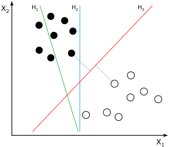
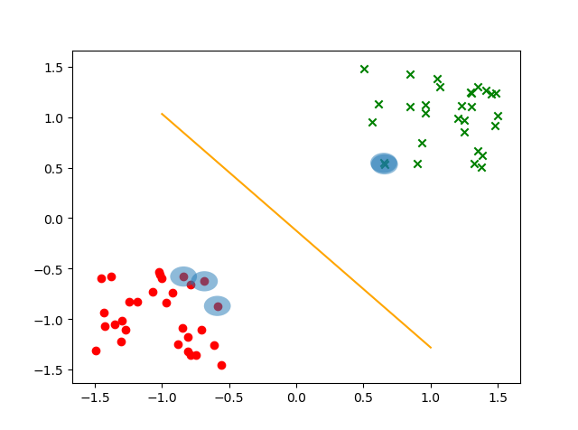

# 机器学习算法——SVM

[TOC]

## 1. 背景

​		在线性分类任务中，对于同一个数据集，可能有多个分离超平面。例如在下图中，H2和H3都能够将白色点和黑色点分离开来，那么在这些分界面中，是否存在一个最优的分界面？一个直观的想法是，离所有点都比较远的分割面会是一个好的分割面。可以证明，这样的最优分割面是唯一的。因此SVM的目标就变成了寻找最大间隔分离超平面。



## 2. SVM推导

### 2.1 几何间隔和函数间隔

​		对于数据集$\{x_i, y_i\}_{i=1}^N, y_i \in\{-1, +1\}$，分类器$f(x)=w^Tx + b$，任意点$x_i$到分割面的几何间隔为：
$$
d_i = \frac{y_i (w^T x_i + b)}{||w||}=y_i \left(\frac{w^T}{||w||}x + \frac{b}{||w||}\right)， d=\min_{i\in\{1, 2, ..., N\}} d_i \label{geo_dist}
$$
从公式可知，如果成比例地改变$w$和$b$，并不会影响$d_i$的值。定义函数间隔：
$$
\hat{d}_i = ||w||d_i = y_i \left(w^T x_i+b\right), \hat{d}=\min_{i\in\{1, 2, ..., N\}} \hat{d}_i \label{func_dist}
$$

### 2.2 SVM原问题

​		最大间隔分离超平面问题可以表述为：
$$
\max_{w,b} d \label{p1}\\ 
s.t \quad d_i = y_i \left(\frac{w^T}{||w||}x + \frac{b}{||w||}\right)\geq d, \forall i \in\{1, 2, ...,N\}
$$
将几何间隔替换为函数间隔，公式$\ref{p1}$可以写作：
$$
\max_{w,b} \frac{\hat{d}}{||w||}\label{p2}\\
s.t \quad y_i \left(w^T x_i+b\right)\geq ||w||d = \hat{d} , \forall i \in\{1, 2, ...,N\}
$$
事实上函数间隔的取值并不会影响问题$\ref{p2}$的最优解（等比例放缩$w$和$b$不会影响不等式约束），取函数间隔$\hat{d} = 1$，公式$\ref{p2}$变为：
$$
\min_{w,b} \frac{1}{2}w^Tw \label{p3}\\
s.t \quad y_i (w^Tx_i+b)\geq 1, \forall i \in\{1, 2, ...,N\}
$$
​		然而在某些情况下，最小函数间隔是1并不能成立（非线性可分情况），为了处理这种情形，引入松弛变量$\xi_i\geq 0$，约束条件变为了函数间隔加上松弛变量要大于1，此时问题$\ref{p3}$变为：
$$
\min_{w,b} \frac{1}{2}w^Tw+C\sum_{i=1}^N\xi_i \label{p4}\\
s.t \quad y_i (w^Tx_i+b)\geq 1 - \xi_i\\ \xi_i \geq 0, \quad \forall i \in\{1, 2, ...,N\}
$$

### 2.3 SVM对偶问题

​		写出问题$\ref{p4}$的拉格朗日函数：
$$
\mathcal{L}(w, b, \xi, \alpha, \mu) = \frac{1}{2}w^Tw + C\sum_{i=1}^N\xi_i + \sum_{i=1}^N \alpha_i(1-\xi_i - y_i(w^T x_i + b)) - \sum_{i=1}^N \mu_i \xi_i, \alpha \geq 0 \label{Lagrangrian}
$$
原始问题为：$\theta_p = \min_{w,b,\xi} \max_{\alpha} \mathcal{L}(w, b,\xi, \alpha)$，对偶问题为：$\theta_d = \max_{\alpha} \min_{w,b,\xi}\mathcal{L}(w,b,\xi,\alpha)$。求解对偶问题：
$$
\nabla_w \mathcal{L}(w, b,\xi, \alpha) = w - \sum_{i=1}^N \alpha_i y_i x_i \label{grad}\\
\nabla_b \mathcal{L}(w, b,\xi, \alpha) = -\sum_{i=1}^N \alpha_i y_i \\
\nabla_{\xi_i}  \mathcal{L}(w, b,\xi, \alpha) = C-\alpha_i-\mu_i , \forall i\in \{1, 2, .., N\}
$$
根据KKT条件得到：
$$
w = \sum_{i=1}^N \alpha_i y_i x_i \label{kkt}\\
\sum_{i=1}^N \alpha_i y_i = 0 \\
C-\alpha_i - \mu_i = 0 \\
\alpha_i \geq 0 \\
\mu_i \geq 0\\
\alpha_i (1-\xi_i - y_i (w^Tx_i+b)) = 0 \\
\mu_i \xi_i = 0 \\
\xi_i \geq 0 \\
y_i (w^Tx_i +b)\geq 1 - \xi_i
$$
将KKT条件代入到对偶问题可得：
$$
\max_\alpha \frac{1}{2}\sum_{i=1}^{N}\sum_{j=1}^N \alpha_i \alpha_j y_i y_j x_i^Tx_j - \sum_{i=1}^N \alpha_i \label{p5}\\
s.t \quad \sum_{i=1}^N \alpha_i y_i = 0\\
0\leq \alpha_i \leq C , \quad \forall i \in \{1, 2, ..., N\}
$$
同时观察KKT条件可以得到：

+ 如果$\alpha_i < C$，一定有$\xi_i = 0$（$\mu_i = C -\alpha_i \neq 0 \Longrightarrow \xi_i = 0$），支持向量$x_i$恰好落在边界
+ 如果$\alpha_i = C, 0<\xi_i < 1$，则$x_i$分类正确，在间隔边界与超平面之间
+ 如果$\alpha_i = C, \xi_i = 1$，则$x_i$落在超平面上
+ 如果$\alpha_i = C, \xi_i > 1$，则$x_i$分类错误


### 2.4 SMO算法

#### 2.4.1 更新公式

​		问题$\ref{p5}$仍然是一个二次规划问题，可以用一般的QP算法解决。但是对于SVM模型，有一种更加快速的优化算法。类似于坐标下降，SMO每次固定其他变量，只优化两个变量。

​		假设在问题$\ref{p5}$中，选择优化变量$\alpha_1, \alpha_2$。等式约束可以改写为：
$$
\alpha_1 y_1 + \alpha_2 y_2 = -\sum_{i=3}^N \alpha_i y_i  \triangleq \zeta \label{alpha1_alpha2}\\
\alpha_2 = \zeta y_2 -\alpha_1 y_1 y_2
$$
将待优化的变量分离出来，并将$\alpha_2$替换掉：
$$
\begin{aligned}
g(\alpha_1, \alpha_2) =& \frac{1}{2}\alpha_1^2 K_{11} + \frac{1}{2} \alpha_2^2 K_{22} + \alpha_1 \alpha_2 y_1 y_2 K_{12} + \alpha_1 y_1\sum_{i=3}^N \alpha_i y_i K_{1i} + \alpha_2 y_2\sum_{i=3}^N \alpha_i y_i K_{2i} \\
&+ \frac{1}{2}\sum_{i=3}^{N}\sum_{j=3}^N \alpha_i \alpha_j y_i y_j K_{ij} -(\alpha_1 + \alpha_2) - \sum_{i=3}^N \alpha_i \\ 
=& \frac{1}{2}\alpha_1^2 K_{11} + \frac{1}{2}\left( \zeta y_2 - \alpha_1 y_1 y_2\right)^2 K_{22} + \alpha_1 \left( \zeta y_2 - \alpha_1 y_1 y_2\right) y_1 y_2 K_{12}\\
&+ \alpha_1 y_1 v_1 + \left( \zeta y_2 - \alpha_1 y_1 y_2\right)y_2 v_2 -\alpha_1 - \zeta y_2 + \alpha_1 y_1 y_2 + \mathrm{const} \\
=& \frac{1}{2} \left( K_{11} - 2K_{12} + K_{22}\right)\alpha_1^2 + \left[\zeta y_1(K_{12} - K_{22}) + y_1(v_1 -v_2)+(y_1 y_2 - 1) \right]\alpha_1 + \mathrm{const} 
\end{aligned}\label{alpha1}\tag{12}
$$
因此有：
$$
\frac{\partial g}{\partial \alpha_1} = (K_{11} - 2K_{12}+K_{22})\alpha_1 + \zeta y_1(K_{12} - K_{22}) + y_1(v_1 -v_2)+(y_1 y_2 - 1) \label{grad_alpha1}
$$
其中：
$$
v_1 = \sum_{i=3}^N \alpha_i y_i K_{1i} = \sum_{i=1}^N \alpha_i^{old} y_i K_{1i} - \alpha_1^{old}y_1 K_{11} - \alpha_2^{old}y_2 K_{12}  = f(x_1) - \alpha_1^{old}y_1 K_{11} - \alpha_2^{old}y_2 K_{12} - b \label{v}\\
v_2 = \sum_{i=3}^N \alpha_2 y_i K_{2i} = \sum_{i=1}^N \alpha_i^{old} y_i K_{2i} - \alpha_1^{old}y_1 K_{21} - \alpha_2^{old}y_2 K_{22} = f(x_2) - \alpha_1^{old}y_1 K_{21} - \alpha_2^{old}y_2 K_{22} - b
$$
所以：
$$
\begin{aligned}
v_1 - v_2 &= f(x_1) - f(x_2) - \alpha_1^{old}y_1(K_{11}-K_{21}) - (\zeta y_1 - \alpha_1 y_1 y_2)y_2(K_{12}-K_{22}) \\ 
&= f(x_1) - f(x_2) - \alpha_1^{old}y_1(K_{11} - 2K_{12} + K_{22}) - \zeta y_1 y_2 (K_{12} - K_{22}) \label{diff_v}
\end{aligned}
$$
带入到公式$\ref{grad_alpha1}$得到：
$$
\begin{aligned}
\frac{\partial g}{\partial \alpha_1} &= (K_{11} - 2K_{12}+K_{22})\alpha_1^{new} + \zeta y_1(K_{12} - K_{22}) \\
&+ y_1( f(x_1) - f(x_2) - \alpha_1^{old}y_1(K_{11} - 2K_{12} + K_{22}) - \zeta y_1 y_2 (K_{12} - K_{22}))+(y_1 y_2 - 1)\\
&= (K_{11} - 2K_{12}+K_{22})(\alpha_1^{new}-\alpha_1^{old}) + y_1 ((f(x_1) - y_1)-(f(x_2) -y_2)) \\
&= (K_{11} - 2K_{12}+K_{22})(\alpha_1^{new}-\alpha_1^{old}) - y_1 (E_1-E_2) \label{grad_alpha1_2}
\end{aligned}
$$
其中$E_i = y_i - f(x_i)$，令该导数为0，得到：
$$
\alpha_1^{new} = \alpha_1^{old} + \frac{y_1(E_1-E_2)}{K_{11} - 2K_{12}+K_{22}}\label{alpha1_new}
$$

#### 2.4.2 裁剪		

​		**现在考虑对偶问题中的框约束**。$\alpha_1, \alpha_2$的等式约束$\ref{alpha1_alpha2}$可以写作：
$$
\alpha_1^{new} y_1 + \alpha_2^{new} y_2 = \zeta = \alpha_1^{old} y_1 + \alpha_2^{old} y_2 \label{old_new}
$$
对$y_1, y_2$分类讨论：

+ 当$y_1 \neq y_2$时，$\alpha_{1}^{new}-\alpha_2^{new} = k = \alpha_1^{old}-\alpha_2^{old}$

  + $k>0\Longrightarrow \alpha_1 \in \left[k, C\right]$
  + $k < 0\Longrightarrow \alpha_1 \in \left[0, C+k\right]$

  因此有$L = \max\{0, \alpha_1^{old}-\alpha_2^{old}\}, H = \min\{C, C + \alpha_1^{old}-\alpha_2^{old}\}$

+ 当$y_1 = y_2$时，$\alpha_{1}^{new}+\alpha_2^{new} = k = \alpha_1^{old}+\alpha_2^{old}$，同上一种情况可得$L = \max\{0, \alpha_1^{old}+\alpha_2^{old}-C\}, H = \min\{C, \alpha_1^{old}+\alpha_2^{old}\}$


对$\alpha_1^{new}$的裁剪过程如下：
$$
\begin{equation}\label{clip}
\alpha_1^{new,cliped}=
\begin{cases}
H&,\alpha_1^{new}\geq H \\
\alpha_1^{new}&, L<\alpha_1^{new}< H\\
L&, \alpha_1^{new}\leq L
\end{cases}
\end{equation}
$$
在计算出$\alpha_1^{new}$之后，代入$\ref{old_new}$可以得到：
$$
\alpha_2^{new} = \alpha_2^{old}+y_1 y_2 (\alpha_1^{old}-\alpha_1^{new}) \label{alpha2_new}
$$

#### 2.4.3 优化变量的选择		

​		**$\alpha_i, \alpha_j$的选择**。在选择第一个变量$\alpha_i$时，找出违反KKT条件最严重的，这样能加快优化过程。KKT条件具体是：
$$
\begin{aligned}
\alpha_{i} &=0 \Leftrightarrow y_{i} f\left(x_{i}\right) \geqslant 1 \\
0<\alpha_{i} &<C \Leftrightarrow y_{i} f\left(x_{i}\right)=1 \\
\alpha_{i} &=C \Leftrightarrow y_{i} f\left(x_{i}\right) \leqslant 1
\end{aligned}
$$
其中$f\left(x_{i}\right)=\sum_{j=1}^{N} \alpha_{j} y_{j} K\left(x_{i}, x_{j}\right)+b$。在检验时，首先在支持向量中寻找，即$0<\alpha_{i} <C$，如果支持向量都满足KKT条件，则在全部数据集中寻找。在给定了第一个变量时，第二个变量$\alpha_j$的选择要使$\alpha_j$有足够大的变化，即使$|E_i -E_j|$最大。

#### 2.4.4 偏移$b$和误差$E_i$的更新

​		根据KKT条件可知，当向量$x_i$是支持向量时有$y_{i} f\left(x_{i}\right)=1$。在计算完$\alpha_1^{new}$之后，如果$0<\alpha_1^{new}<C$：
$$
\sum_{i=1}^N y_i \alpha_i K_{1i} + b= y_1
$$
于是有：
$$
b = y_1 - \sum_{i=1}^N y_i \alpha_i^{old} K_{1i} + y_1K_{11}(\alpha_1^{old}-\alpha_1^{new})+y_2 K_{12}(\alpha_2^{old} - \alpha_2^{new})
$$
代入$E_1 = y_1 - f(x_1) = y_1 - \sum_{i=1}^N \alpha_i^{old}y_i K_{1i}-b^{old}$得到：
$$
b^{new} = E_1 + y_1K_{11}(\alpha_1^{old}-\alpha_1^{new})+y_2 K_{12}(\alpha_2^{old} - \alpha_2^{new}) + b^{old}
$$
同样地当$0<\alpha_2^{new}<C$，有：
$$
b_{2}^{\text {new }}=E_{2}+y_{1} K_{12}\left(\alpha_{1}^{\text {old }}-\alpha_{1}^{\text {new }}\right)+y_{2} K_{22}\left(\alpha_{2}^{\text {old }}-\alpha_{2}^{\text {new }}\right)+b^{\text {old }}
$$
当$\alpha_1^{new}, \alpha_2^{new}$是0或者C时，选择$\frac{b_1^{new} + b_2^{new}}{2}$作为更新值（因为在$[b_1^{new}, b_2^{new}]$中的数都能满足KKT条件，选中点作为近似）

​		当更新完$\alpha_1, \alpha_2, b$之后，误差$E_i$更新为：
$$
E_{i}^{\text {new }}=y_i - \sum_{S} y_{j} \alpha_{j} K\left(x_{i}, x_{j}\right)+b^{\text {new }}
$$
其中$S$是支持向量的集合。

## 3. SVM的python实现

SVM有很多实现方式：

+ hingle loss；可以证明，线性SVM问题和采用hingle loss的线性分类器是等价的，因此可以使用梯度下降方法进行优化
+ SMO；简单的实现是选择一个符合条件的$\alpha_i$，然后随机挑选一个$\alpha_j$。为了加快训练速度，可以根据某些准则合理地选择
+ 二次优化；直接使用QP求解器

本文实现了simple smo，代码如下：

```python 
#!/usr/bin/env python 
# -*- coding:utf-8 -*-
# -*- coding: utf-8 -*-

import numpy as np
# 裁剪函数
def clip(x, L, H):
    if(x < L):
        x = L
    elif(x > H):
        x = H
    return x
# 随机选择数字
def rand_select(i, m):
    j = i
    while(j == i): j = int(np.random.uniform(0, m))
    return j

class SVM():
    def __init__(self, kernel="linear", C = 1.0, sigma=1.0, **kwargs):
        # 只支持线性核和高斯核
        if (kernel not in ['linear', 'gaussian']):
            raise ValueError("Now only support linear and gaussian kernel")
        elif kernel == "linear":
            kernel_fn = Kernel.linear()
        elif kernel == "gaussian":
            kernel_fn = Kernel.gaussian(sigma)

        self.kernel_method = kernel
        self.kernel = kernel_fn

        self.sigma = sigma
        self.C = C

        self.w , self.b = None, None
        self.n_sv = -1
        self.sv_x, self.sv_y, self.alphas = None, None, None
        self.eps = 1e-6

    # 预测函数， y = \sum_(i in S) alpha_i y_i K(x_i, x) + b
    def predict(self, x):
        wx = self.b
        for i in range(len(self.sv_x)):
            wx += self.alphas[i] * self.sv_y[i] * self.kernel(self.sv_x[i], x)
        return wx

    '''
    svm训练，常见的方法有以下几种:
    1. simple_smo
    2. smo
    3. cvopt
    4. hinge loss
    目前只实现了simple_smo
    '''
    def train(self, X, y, maxIter = 500):
        # 计算核矩阵
        if(self.kernel_method == "linear"):
            K = np.dot(X, X.T)
        elif (self.kernel_method == "gaussian"):
            d2 = np.sum(X ** 2, axis = -1, keepdims= True) - 2 * np.dot(X, X.T) + np.sum(X ** 2, axis = -1,)
            K = np.exp(- 0.5 * d2 / self.sigma)

        # 优化
        alphas, b = self._SMO(K, y, maxIter = maxIter)

        # 计算支持向量
        idx = [i for i in range(len(alphas)) if alphas[i] > self.eps]
        self.n_sv = len(idx)
        self.sv_x = X[idx,:]
        self.alphas = alphas[idx]
        if self.kernel_method == "linear":
            self.w = np.sum((self.alphas * y[idx]).reshape(-1, 1) * X[idx,:], axis = 0)
        self.b = b

    def _SMO(self, K, y, tol = 0.001, maxIter = 40):
        print("begin SMO...")
        m = len(y)
        self.alphas, self.b = np.zeros(m), 0.
        y = y.reshape(1, -1)

        niter = 0
        while (niter < maxIter):
            # select alpha_i, alpha_j
            changed = 0
            for i in range(m):
                # 在外层循环中，选择一个违反了KKT条件的alpha_i
                yi, ai_old = y[0][i], self.alphas[i].copy()
                Ei = np.dot(self.alphas * y , K[i].T) + self.b - yi
                if ((yi * Ei < -tol) and (ai_old < self.C)) or ((yi * Ei > tol) and (ai_old > 0)):
                    # 随机找内层的alpha_j
                    j = rand_select(i, m)
                    yj, aj_old = y[0][j], self.alphas[j].copy()
                    Ej = np.dot(self.alphas * y, K[j].T) + self.b - yj

                    # 更新 alpha_j
                    eta = K[i, i] + K[j, j] - 2 * K[i, j]
                    if(eta <= 0): continue;
                    aj_new = aj_old + yj * (Ei - Ej) / eta

                    # 裁剪 alpha_j
                    if yi != yj:
                        L, H = max(0, aj_old - ai_old), min(self.C, self.C + aj_old - ai_old)
                    else:
                        L, H = max(0, aj_old + ai_old - self.C), min(self.C, aj_old + ai_old)
                    if H - L == 0:
                        continue
                    aj_new = clip(aj_new, L, H)

                    # 更新alpha_i
                    s = yi * yj
                    delta_j = aj_new - aj_old
                    if(abs(delta_j) < self.eps): continue;
                    ai_new = ai_old - s * delta_j
                    delta_i = ai_new - ai_old

                    # 更新b
                    bi = self.b - Ei - yi * delta_i * K[i, i] - yj * delta_j * K[i, j]
                    bj = self.b - Ej - yi * delta_i * K[i, j] - yj * delta_j * K[j, j]

                    if 0 < ai_new < self.C:
                        self.b = bi
                    elif 0 < aj_new < self.C:
                        self.b = bj
                    else:
                        self.b = (bi + bj) / 2
                    self.alphas[i], self.alphas[j] = ai_new, aj_new
                    changed += 1
            if (changed == 0):
                niter +=1;
            else:
                niter = 0

        print("Finish SMO...")
        return self.alphas, self.b

'''
核函数的单独实现，后期可以在里面添加
'''
class Kernel(object):
    # 线性核
    @staticmethod
    def linear():
        return lambda X, y: np.inner(X, y)

    # 高斯核
    @staticmethod
    def gaussian(sigma):
        return lambda X, y: np.exp(-np.sqrt(np.linalg.norm(X - y) ** 2 / (2 * sigma)))
```

测试代码：

```python
#!/usr/bin/env python 
# -*- coding:utf-8 -*-

import numpy as np
import matplotlib.pyplot as plt
from matplotlib.patches import Circle

# generate data

anchors = np.array([[-1, -1], [1, 1]]) * 0.5
n1 = np.random.random((30, 2))
n2 = np.random.random((30, 2))
X1 = anchors[0] - n1
X2 = anchors[1] + n2
y1 = np.array([-1]*30)
y2 = np.array([1]*30)

print("trianing...")
X = np.vstack((X1, X2))
y = np.hstack((y1, y2))

idx = np.array(range(len(y)))
np.random.shuffle(idx)
X = X[idx,:]
y = y[idx]

from svm import *
model = SVM(C = 0.6, kernel="linear")
model.train(X, y, maxIter = 40)

print(model.n_sv)
print(model.sv_x)
print(model.sv_y)

xx = np.array([-1, 1])
yy = -model.w[0] / model.w[1] * xx - model.b / model.w[1]
fig = plt.figure()
ax = fig.add_subplot(111)
for i in range(len(y)):
    if y[i] == -1:
        ax.scatter(X[i][0], X[i][1], marker = "o", color = "red")
    else:
        ax.scatter(X[i][0], X[i][1], marker="x", color="green")

for sv_x in model.sv_x:
    cir1 = Circle(xy = (sv_x[0], sv_x[1]), radius=0.1, alpha=0.5)
    ax.add_patch(cir1)

ax.plot(xx, yy, color = "orange")
plt.show()
```

测试结果如下：



## 4. 改进

+ LRU缓存；在SVM+SMO中的实现中，核矩阵的计算成为了很大的开销。如果预先将核矩阵计算好，空间复杂度为$O(N^2)$，如果边用边计算，又会因为重复计算增加开销。考虑到在实际计算中，用到的样本仅为支持向量附近的一些数据点，因此用两个cache保存核和误差，在对参数更新之后更新缓存即可。

+ 冷热数据分离；在更新参数时，优先更新支持向量（热数据）对应的$\alpha$（即$0<\alpha<C$），在没有这样的点时，再全局（冷数据）寻找进行更新。

